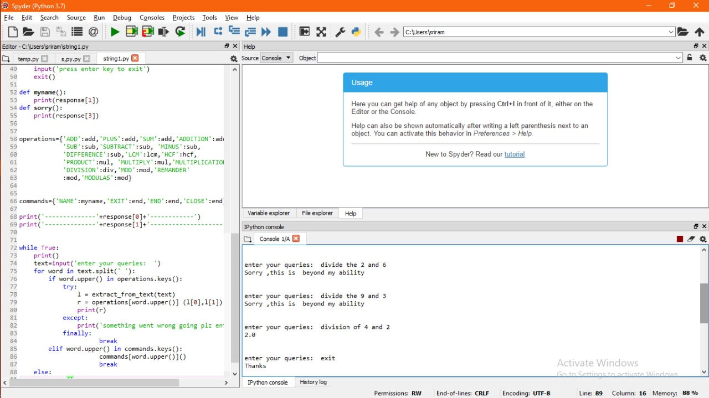

## SMART CALCULATOR ##

This smart calculator works on the text statement also. The user need not provide algebraic expression always. It fetches the word form the command (given by the user) and then formulates the expression.

## OUTPUT ##

